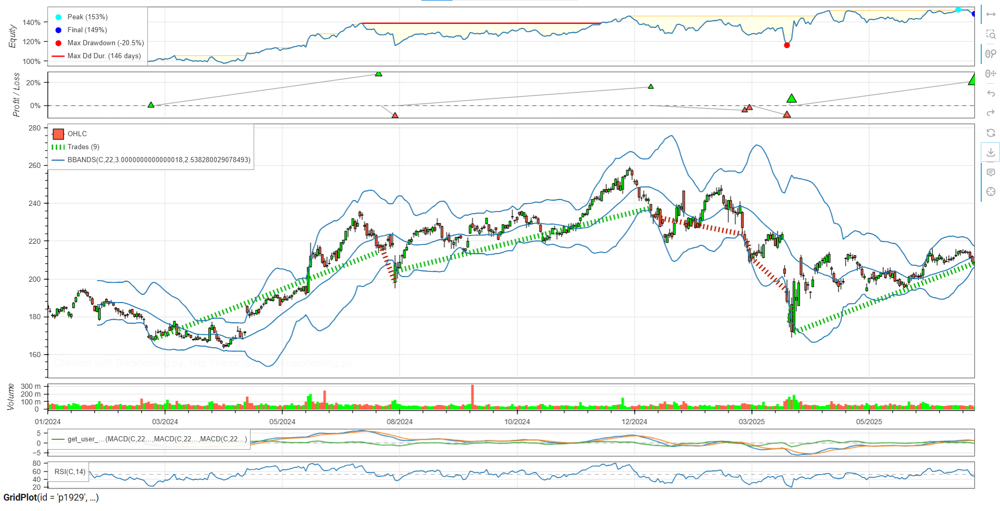
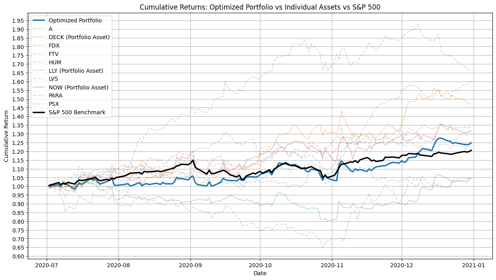

# Projects

>A collection of my quantitative finance projects, categorized for easier browsing.  👋

**Introduction:**

Welcome! I'm a quantitative finance professional passionate about applying machine learning, deep learning, and portfolio optimization techniques to solve complex financial problems. My interests span backtesting, machine learning, and portfolio optimization. This repository showcases a selection of my projects developed during my Financial Engineering Degree.

## Projects

This section details my quantitative finance projects, providing descriptions, technologies used, links to the code, and visualizations of key results.

### 1. Backtesting Trading Strategy with Backtesting.py
* **Description:** This project demonstrates how to implement and evaluate a trading strategy using the `backtesting.py` library. It includes data preparation, strategy definition, and performance analysis through backtesting on historical stock data. The notebook provides clear visualizations of the strategy’s performance, helping to identify strengths and weaknesses before deploying in live trading.
* **Technologies:** Python, backtesting.py
* **Link:** [Project Link](https://github.com/kachunchan-analytics/projects/blob/main/StockBacktesting.ipynb)
* **Colab Notebook:** 
* **Key Results:**
    * Backtesting Plots: 
    

### 2. Stock Price Movement Prediction using Convolutional Neural Networks and Gramian Angular Fields (GAF)

* **Description:** This project predicts stock price movements using a Convolutional Neural Network (CNN). Time series data was converted into images using Gramian Angular Fields (GAF) for input to the CNN.
* **Technologies:** Python, GAF, TensorFlow/Keras (Keras was used), Scikit-learn
* **Link:** [Project Link](https://github.com/kachunchan-analytics/projects/blob/main/ConvolutionalNeuralNetwork_Prediction.ipynb)
* **Colab Notebook:** 
* **Key Results:**
    * GAF Representation: 
    
    * Classification Results: 
    

### 3. Factor Investing and Stock Return Prediction with Regression

* **Description:** This project investigates the application of linear regression models for factor investing and stock return prediction. It explores the relationship between stock returns and a set of factors, such as market returns, industry returns, and value factors. The project uses historical data to estimate the factor exposures of stocks and assess their performance using linear regression models.
* **Technologies:** Python, FF5, Pandas, NumPy, Scikit-learn, Statsmodels
* **Link:** [Project Link](https://github.com/kachunchan-analytics/projects/blob/main/FactorInvesting_Regression.ipynb)
* **Colab Notebook:** 
* **Key Results:**
    * Model Formula and Coefficients: 
    
    * FF5 Correlation: 
    

### 4. Using Denoised Covariance Matrix with MVO

* **Description:** This project This demonstrates the method for constructing an optimal investment portfolio by employing techniques to denoise the estimated covariance matrix of asset returns. It addresses the challenge of estimating accurate covariance matrices, which is crucial for modern portfolio theory but can be susceptible to noise from limited historical data. The approach involves using concepts from random matrix theory, specifically the Marchenko-Pastur distribution, to identify and separate the "signal" from the "noise" in the eigenvalues of the asset correlation matrix. This denoised covariance matrix is then used within the Markowitz mean-variance optimization framework to determine the portfolio weights that maximize the Sharpe ratio.
* **Technologies:** Python, Pandas, NumPy
* **Link:** [Project Link](https://github.com/kachunchan-analytics/projects/blob/main/DenoisedCovariance_with_MVO.ipynb)
* **Colab Notebook:** 
* **Key Results:**
    * Denoised Covariance Matrix: 
    
    * Benchmark against Index: 
    

## 5. Stock Price Prediction using Neural Networks

* **Description:** This project predicts stock prices using historical data and a neural network. Hyperparameter optimization was performed using Grid Search.
* **Technologies:** Python, Scikit-learn, yfinance, TensorFlow/Keras (Keras was used)
* **Link:** [Project Link](https://github.com/kachunchan-analytics/projects/blob/main/StockPricePrediction_NeuralNetwork.ipynb)
* **Colab Notebook:** 
* **Key Results:**  

## Future Projects:

* **Option Pricing using Deep Learning:**  Explore the application of deep learning models, such as Recurrent Neural Networks (RNNs) or Convolutional Neural Networks (CNNs), for pricing complex options beyond the Black-Scholes framework. This would involve generating synthetic option data, training the models, and evaluating their performance against benchmark models.  The project will focus on handling high-dimensional input features and potentially incorporating market microstructure data.

* **Portfolio Optimization with Reinforcement Learning:** Develop a reinforcement learning agent to dynamically optimize a portfolio based on market conditions.  This will involve designing a suitable reward function, choosing an appropriate reinforcement learning algorithm (e.g., Deep Q-Network, Proximal Policy Optimization), and evaluating the performance of the agent against traditional portfolio optimization techniques.  Transaction costs and risk management will be key considerations.

* **Algorithmic Trading Strategy Backtesting and Optimization:** Develop a robust backtesting framework for evaluating and optimizing various algorithmic trading strategies. This would involve using historical market data, implementing different trading strategies (e.g., mean reversion, momentum), and evaluating their performance using various metrics (e.g., Sharpe ratio, maximum drawdown).  The project will also explore techniques for optimizing trading parameters to maximize profitability and minimize risk.

* **Regime Detection with HMM model:** Perform regime detection with hidden markov mdoel, to identify bull/bear regimes

* **Sentiment Analysis for Financial Markets:**  Utilize Natural Language Processing (NLP) techniques to analyze news articles, social media posts, and financial reports to gauge market sentiment and predict price movements.  This would involve collecting and cleaning textual data, applying sentiment analysis algorithms, and integrating the sentiment scores into a trading strategy or risk management model.
